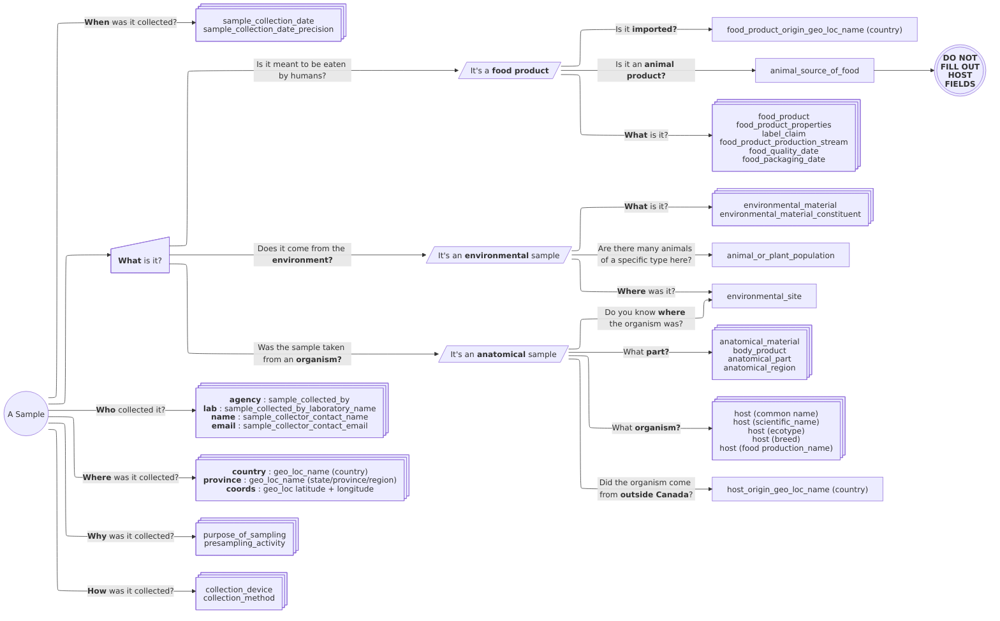
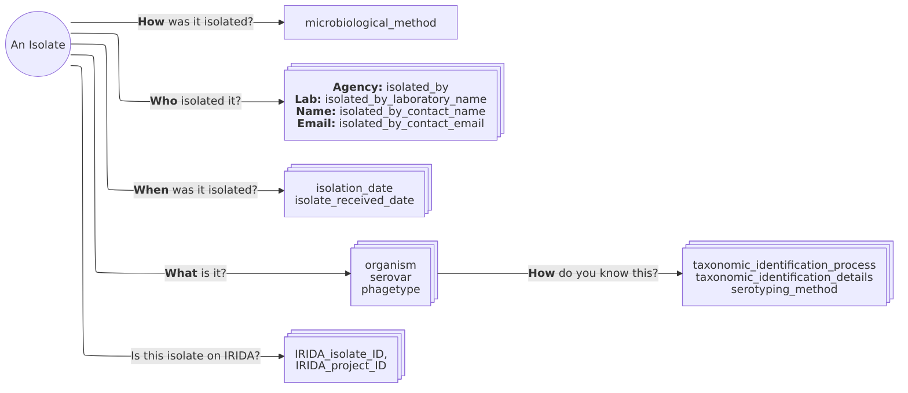

# An SOP for the standardization and submission of GRDI-AMR2 metadata and sequence data

Version 1.1

Written by Emil Jurga and Gabriel Wajnberg

## Introduction

All data collected by researchers participating in the GRDI-AMR2 project must be formatted according to the GRDI-AMR2 One Health standard and submitted to a central database (the VMR).
This is to ensure long-term accessibility of the data and facilitate analyses across labs and departments.
Since metadata associated with each project is likely to look very different from the standard, some work must be done to format or _harmonize_ the data to the standard.
This SOP outlines the workflow for handling sample and isolate data and metadata curation.
It also outlines the process for submitting data to the database, as well as to the NCBI and IRIDA.

## Terms

- **The GRDI-AMR One Health data standard:** The set of fields, terms, and rules that represent how data should be formatted ([hosted on github](https://github.com/cidgoh/GRDI_AMR_One_Health))
- **The Virtual Microbial Resource (VMR):** The central database that stores the metadata.
    This database ensures the integrity of the metadata and provides additional functionality, such as exporting to other formats.
- **The Science Network:** The suite of servers and IT infrastructure to host and support science projects hosted by the National Microbiology Laboratory Branch of PHAC.
- **Science Credentials:** The username and password used to access the science network. 
    When logging in via Microsoft Windows portals, your username will be of the format _username_@**CSCScience.ca**
- **IRIDA:** Integrated Rapid Infectious Disease Analysis tool.
    This application hosts sequencing data.
    When connected to the Science Network VPN, the link is [ngs-archive.corefacility.ca](http://ngs-archive.corefacility.ca).
- **The GCExchange:** The website/repository that is being used to share documents, data, and SOPs ([link](https://gcxgce.sharepoint.com/teams/100001292)).
- **The curators:** The people responsible for managing the GRDI-AMR One Health data standard, inputting data into the VMR, double-checking that data has been properly standardized,
    and helping with any other data-related issues.
    They are:
    - [Emma Griffiths](mailto:emma_griffiths@sfu.ca) (SFU). For high-level questions about the data standard, and initial curation check-pointing of sample groups.
    - [Gabriel Wajnberg](mailto:gabriel.wajnberg@inspection.gc.ca) (CFIA). For data submission, data export, NCBI submissions, and data standard new term or field requests.
    - [Emil Jurga](mailto:emil.jurga@phac-aspc.gc.ca) (PHAC). Same as Gabriel Wajnberg, but additionally for questions regarding IRIDA and the Science Network.

## Connecting to the Science Network

Access to the NMLB's science network network has been extended to all members of the GRDI-AMR2 to support the project.
Access is required to upload and access sequences on IRIDA, and view dashboards connected to the VMR.
While most researchers _should_ already have their own science network account, it may need to be renewed.
Please contact [Emil Jurga](mailto:emil.jurga@phac-aspc.gc.ca) or the [NML's Science IT Helpdesk](mailto:helpdesk@nml-lmn.phac-aspc.gc.ca) to either renew or request an account.
The VPN address is [remote.corefacility.ca](http://remote.corefacility.ca) (using cisco AnyConnect).
However, most users should connect to the science network via [NMLconnect](https://connect.nml-lmn.phac-aspc.gc.ca/), which enables access through the corporate VPN.
Log in to this portal using your **science credentials** (_username_@**CSCScience.ca**). 
The chrome application has many bookmarks pre-configured to access most of what you'll need, including IRIDA.

## Tools

Each lab is likely to have their own methods for collecting and storing metadata, from Excel workbooks, to SQL or Microsoft Access databases, or even plain text files (e.g., CSV or TSV formats).
Possibly, different formats are used for different types of data.
At this point, two different tools have been made accessible to help researchers format their data according to the GRDI-AMR OneHealth data standard:

1.  The DataHarmonizer ([GitHub repository link](https://github.com/cidgoh/pathogen-genomics-package)).
    This is the **recommended** method to standardize your data.
    It is a web-based application purpose built to help researchers format data according the pre-defined data standards.
    It is also based on a spreadsheet layout (e.g., with rows, fields, and cells) but implements multiple useful features such as data-validation, search bars for fields, and help-dialogues.
    Installation of the tool is relatively simple (instructions at the link).
    Note that the default data template is **not** the GRDI-AMR2 data standard, make sure to select the GRDI template before proceeding.

2.  The Excel Workbook ([GitHub repository link](https://github.com/cidgoh/GRDI_AMR_One_Health)). 
    Note however that this is excel sheet **is being retired**, as it is too difficult to maintain alongside the DataHarmonizer.
    This is an Excel Workbook with the fields and controlled vocabulary implemented.
    Different metadata categories are split across different tabs in the workbook.
    Excel macros are used to combine the sheets at the end, but this functionality is not required to insert the data into the VMR.
    This method has the advantage of being implemented using a familiar tool to most researchers.
    However, some researchers might find it slow to use, particularly with datasets comprising many rows.
    Note that this repo also contains documentation and SOPs regarding the fields and terms of the standard.

## Overview:

In general, it is likely that metadata collected follows a similar hierarchical structure.

The researcher takes _samples_ of whatever it is they are studying, be it a food product, animal or human tissue or waste, or environmental samples of water, soil, or wastewater (and etc).
From these samples, the researcher might _isolate_ microorganisms for further study.
Most researchers of GRDI-AMR2 are leveraging genomic sequencing in some capacity.
Bacterial isolates might be processed for whole genome sequences, or samples might be processed for shotgun metagenomics or bait capture.
In addition, some bacterial isolates might be sent off for antimicrobial susceptibility testing.
Throughout, it is possible that many isolates might be taken from a single sample, or perhaps none at all.
Similarly, an isolate might be sequenced multiple times.
Some projects have opted not to isolate any bacteria from their samples at all, opting instead for a pure metagenomics approach.
Whatever the structure of your data, submission to WP6 is best undertaken in a series of steps, with checkpoints with the data curators along the way to catch errors quickly and assess/add new terms or fields as needed.

## Checklist

1. Sample collection information:
    - [ ] Determine Project Name and Sample Plan Name for your samples and isolates.
    - [ ] Determine sample groups with distinct metadata fields.
    - [ ] **Correspond with curators about sample groups**
    - [ ] Relate sample IDs to sample groups
    - [ ] Standardize remaining fields
    - [ ] **Send sample metadata to curators**
2. Isolate information:
    - [ ] Standardize fields relating to isolate and strain information
    - [ ] **Send isolate metadata to curators**
3. Sequence Data:
    - [ ] Standardize fields relating to sequence information
    - [ ] **Send sequence information to curators**
    - [ ] Create IRIDA project for Sequences
    - [ ] Give **curators** collaborator permission on the IRIDA project
    - [ ] Create IRIDA samples
    - [ ] Upload sequences to IRIDA
    - [ ] **Contact the curators so they can update your data in the VMR with IRIDA related information**
4. AST Data:
    - [ ] **Correspond with curators about the nature of your AST data**
    - [ ] Send curators AST data
5. Exporting to NCBI:
    - [ ] **Contact Gabriel Wajnberg to request access to the GRDI-AMR2 submission group**
    - [ ] Create BioProject
    - [ ] Create BioSample submission
    - [ ] **Contact curators to upload formatted metadata to your BioSample submission**
    - [ ] Create SRA submission
    - [ ] Use IRIDA uploader to upload sequences to NCBI (if few sequences) _OR_ **Contact curators to upload sequences to SRA**

## Project name and Sample Plan

First, define _at least_ a project name under which your samples/isolates will be assigned.
A project name should be concise but descriptive enough to easily identify where the samples/isolates came from.

A sample plan **is not** another identifier for a project.
Instead, it should refer to documentation or an SOP that defines the methods and procedures used to collect samples and isolates.
For example, a sampling plan might define which hospitals isolates are sampled from, and the methods to be used to culture organisms.
Not all projects will have a sampling plan, but if it does, it is *immensely useful* to link to your samples and isolates.

## Sample and collection information

### Example Data

For this SOP, we will be using some example data to guide us through the submission process.
This data was collected by Work Package 4.2, and consists of samples from imported foods.
These samples are pooled and sequenced to identify potential isolates of interest, and if any are found, the samples are further processed to isolate bacteria for downstream analysis.
Here is a subset of these data:

| sample ID          | import country           | collection date             | food product            | Processing | Quality Date              |
| --                 | --                       | --                          | --                      | --         | --                        |
| CFIA-AMR-2022-0001 | United States of America | Wednesday, August 10, 2022  | Frozen Peaches          | Sliced     | 6/22/2024                 |
| CFIA-AMR-2022-0002 | Peru                     | Wednesday, August 10, 2022  | Frozen Mango            | Chunks     | 6/16/2024                 |
| CFIA-AMR-2022-0003 | Peru                     | Wednesday, August 10, 2022  | Frozen Avocado          | Chunks     | 12/16/2023                |
| CFIA-AMR-2022-0004 | Viet Nam                 | Thursday, December 8, 2022  | Frozen coconut-chunks   | Chunks     | 10/17/2024                |
| CFIA-AMR-2022-0005 | Viet Nam                 | Tuesday, November 29, 2022  | Frozen Mango            | Sliced     | 1/10/2024                 |
| CFIA-AMR-2022-0006 | Greece                   | Thursday, December 8, 2022  | Frozen Peaches          | Sliced     | 8/30/2024                 |
| CFIA-AMR-2022-0007 | United States of America | Thursday, December 8, 2022  | Frozen Peaches          | Sliced     | 11/8/2024                 |
| CFIA-AMR-2022-0008 | United States of America | Thursday, December 8, 2022  | Frozen Peaches          | Sliced     | 10/11/2024                |
| CFIA-AMR-2022-0009 | United States of America | Thursday, December 8, 2022  | Frozen Peaches          | Sliced     | 11/21/2024                |
| CFIA-AMR-2022-0010 | Philippines              | Wednesday, January 11, 2023 | Frozen coconut-shredded | Shredded   | Missing [GENEPIO:0001618] |
| CFIA-AMR-2022-0011 | Philippines              | Wednesday, January 11, 2023 | Frozen coconut-shredded | Shredded   | Missing [GENEPIO:0001618] |
| CFIA-AMR-2022-0012 | India                    | Monday, March 20, 2023      | Frozen coconut-shredded | Shredded   | 6/12/2024                 |
| CFIA-AMR-2022-0013 | India                    | Monday, March 20, 2023      | Frozen coconut-chunks   | Sliced     | 6/8/2024                  |
| CFIA-AMR-2022-0014 | India                    | Monday, March 20, 2023      | Frozen coconut-shredded | Grated     | 7/15/2024                 |
| CFIA-AMR-2022-0015 | India                    | Monday, March 20, 2023      | Frozen coconut-shredded | Shredded   | 7/4/2024                  |
| ...                | ...                      | ...                         | ...                     | ...        | ...                       |
| CFIA-AMR-2022-0163 | India [GAZ:00002839]     | Monday, March 20, 2023      | Frozen coconut-shredded | Shredded   | 11/27/2024                |

### A note on sample names

You likely have assigned a sample ID of some kind to your data.
This should be designated as the "sample_collector_sample_id" field in the standard.
For the purposes of the GRDI-AMR2 Project, we expect sample IDs to be **unique across the entire project**.
Therefore, sample IDs that are too short or generic are not acceptable (for example, sample names consisting only of a short string of alphanumerics).
In addition, it is considered best practice to refrain from populating a sample ID with metadata (e.g., canada-coconut-01A) -
this can lead to confusion, particularly if downstream metadata is updated.
Refrain particularly from populating your sample names with sensitive patient identifiers.
Please note that *if you do change* your sample IDs, please put the original ID in the alternative_sample_IDS column, in case you or another researcher needs to refer to them again 
(except in the case of the alternative ID containing sensitive information!).

We *recommend* (but will *not* enforce) that sample names follow the following format:
The abbreviated name of the Agency (e.g., PHAC, CFIA), followed by an abbreviation of the lab name/principle investigator (e.g., CC for "Cathy Carrillo"),
followed _possibly_ by the year if applicable,
followed by an alphanumeric identifier (So in full, e.g., CFIA-CC-2024-ABC123).
We also recommend that **one of** either hyphens ("-") or underscores ("\_") be used as separators in sample names
(i.e., use a consistent separator: CFIA-CC-ABC123 instead of CFIA_CC-ABC123)

Finally, special characters (e.g., !,@,#,/,",',) and spaces *are not allowed* in **any identifier** of the GRDI spec (with the exception of alternative IDs, if necessary).

### Which samples do I include?

In short, all of them.
Or at least, the ones that you have metadata for.
This includes samples that were collected, but resulted in no useful downstream data (e.g., no isolates are extracted, or no sequences are collected).
These samples can still provide valuable information for risk-management and documentation.

### Sample types and recommended fields

Not every field in the GRDI One Health standard is applicable to every sample type.
There are fields reserved for food samples, fields for environmental samples, and still also for samples taken from a host organism (e.g., anatomical samples).
Refer to this flowchart help you get started on which fields to fill out for your samples.

### Identifying sample groups

There are many fields that can be filled out in the GRDI-AMR OneHealth data standard.
Not all of them will be applicable to every research project or work-package.
However, we ask researchers to fill out the template as completely as possible, even if the fields are of no interest to your particular research questions.
For example, in a project taking feces samples from farms, the researcher might be concerned only with the organism (e.g., cow, chicken, pig).
Even so, the data standard has fields that request additional information, such as the breed, farming purpose (e.g., meat or dairy production), and even farming practices (e.g., conventional or organic).
Including this information will make your data more useful for future analyses, and especially for risk-analysis and machine learning.

The first step in the data harmonization is to identify any fields that you might reasonably be able apply to your samples.
Look through the fields and their descriptions to see if any apply.
Taking a look at the allowed terms might help with deciding if a field could applies.
The [GitHub repo of the standard]((https://github.com/cidgoh/GRDI_AMR_One_Health)) contains both field descriptions, possible terms, and SOPs for filling out fields.
A useful SOP to follow alongside this one is the [Metadata Curation SOP](https://github.com/cidgoh/GRDI_AMR_One_Health/blob/main/SOPs/GRDI_Metadata-Curation-SOP-13.4.pdf),
which provides guidance on each field and the terms used for curation.

If you are unsure what a term means, then you might want to use the [Ontological Lookup Service](https://www.ebi.ac.uk/ols4) to lookup the ontology term ID
(e.g., for "coconut meat (frozen)", the ontology ID is *FOODON_00003857*) and get its description.
This is also a good stage to ask the curators for help.
In some cases, there might not be a standard term that fits one of your metadata values -- Send an email to the curators and they can add the term for you.

Even relatively modest sampling plans might still have hundreds of samples, and filling out each field, for each sample, might be prohibitively arduous.
Fortunately, it is likely that your samples can be grouped into discrete sets that share metadata fields.
For example, while WP4.2's stone fruit data consists of 163 samples, these samples can broadly be grouped into 6 types:

| Field Name                           | Frozen coconut-chunks                                                                    | Frozen coconut-shredded                                                                                  | Frozen Mango                                                                             | Frozen Avocado                                                                             | Frozen Peaches                                                                           |
| ---                                  | ---                                                                                      | ---                                                                                                      | ---                                                                                      | ---                                                                                        | ---                                                                                      |
| original_sample_description          | Frozen coconut-chunks                                                                    | Frozen coconut-shredded                                                                                  | Frozen Mango                                                                             | Frozen Avocado                                                                             | Frozen Peaches                                                                           |
| sample_collected_by                  | Canadian Food Inspection Agency (CFIA) [GENEPIO:0100552]                                 | Canadian Food Inspection Agency (CFIA) [GENEPIO:0100552]                                                 | Canadian Food Inspection Agency (CFIA) [GENEPIO:0100552]                                 | Canadian Food Inspection Agency (CFIA) [GENEPIO:0100552]                                   | Canadian Food Inspection Agency (CFIA) [GENEPIO:0100552]                                 |
| purpose_of_sampling                  | Survey study [GENEPIO:0100582]                                                           | Survey study [GENEPIO:0100582]                                                                           | Survey study [GENEPIO:0100582]                                                           | Survey study [GENEPIO:0100582]                                                             | Survey study [GENEPIO:0100582]                                                           |
| geo_loc_name (country)               | Canada [GAZ:00002560]                                                                    | Canada [GAZ:00002560]                                                                                    | Canada [GAZ:00002560]                                                                    | Canada [GAZ:00002560]                                                                      | Canada [GAZ:00002560]                                                                    |
| geo_loc_name (state/province/region) | Ontario [GAZ:00002563]                                                                   | Ontario [GAZ:00002563]                                                                                   | Ontario [GAZ:00002563]                                                                   | Ontario [GAZ:00002563]                                                                     | Ontario [GAZ:00002563], Quebec [GAZ:00002569]                                            |
| environmental_site                   | Retail environment [ENVO:01001448]                                                       | Retail environment [ENVO:01001448]                                                                       | Retail environment [ENVO:01001448]                                                       | Retail environment [ENVO:01001448]                                                         | Retail environment [ENVO:01001448]                                                       |
| food_product                         | coconut meat (frozen) [FOODON_00003857]                                                  | coconut meat (frozen) [FOODON_00003857]                                                                  | Mango [FOODON:00003538]                                                                  | Avocado [FOODON:00003600]                                                                  | Peach (frozen) [FOODON:03301272]                                                         |
| food_product_properties              | Ready-to-eat (RTE) [FOODON:03316636]; sliced [FOODON:03430137]; frozen [FOODON:03302148] | Ready-to (RTE) [FOODON:03316636]; sliced, thin, below 0.5 cm [FOODON:03430145]; frozen [FOODON:03302148] | Ready-to-eat (RTE) [FOODON:03316636]; sliced [FOODON:03430137]; frozen [FOODON:03302148] | Ready-to-eat (RTE) [FOODON:03316636]; ; sliced [FOODON:03430137]; frozen [FOODON:03302148] | Ready-to-eat (RTE) [FOODON:03316636]; sliced [FOODON:03430137]; frozen [FOODON:03302148] |
| food_packaging                       | Plastic bag, sack or pouch [FOODON:03490166]                                             | Plastic bag, sack or pouch [FOODON:03490166]                                                             | Plastic bag, sack or pouch [FOODON:03490166]                                             | Plastic bag, sack or pouch [FOODON:03490166]                                               | Plastic bag, sack or pouch [FOODON:03490166]                                             |

In the above example, we see that many of the fields are actually the same across all the metadata fields (e.g., all the samples are collected by the CFIA, and the "purpose_of_sampling" is always a Survey Study).
In the data, the "food_product" related fields might change sample to sample, but is consistent across a sample group, and so only needs to be set once for it to apply to all samples in the group.
Now, so long as each individual sample is associated with a _sample group_, the curators can easily apply the metadata fields to each sample.
We recommend setting the "original_sample_description" to your sample groups for each sample.

Setting metadata values this way has two advantages.
First, it reduces the amount of labor required to standardize; in the above example, we effectively needed to fill out metadata for only 6 samples, instead of 173.
Second, it is easier for the metadata curators to glance at the metadata fields and assess if anything is missing, or needs to be changed.
If your data can be organized like this, we encourage you to do so and send it to the curators before proceeding with the rest of your data.
An example of a sheet you might use to help you with this can be found [on the GCExchange](https://gcxgce.sharepoint.com/:x:/t/100001292/EUiJpom31tlDv8ZDQg8ARiABSp6u8f3MyLo63aN_z-ariQ?e=KCRsqk).

### Variable sample fields

After the curators have verified that the sample group metadata looks alright, you can move on to standardizing the rest of the sample collection metadata
Date fields, such as "sample_collected_date" and "sample_received_date" are commonly too variable to be sorted neatly into groups.
How to standardize these fields will depend on how your data is formatted.
In some cases, it might be as simple as renaming the column, while others might require some converting between formats.
For example, in the example Stone Fruit data, the "collection date" and "quality date" fields must be formatted to match the date standard.
Excel provides functionality to convert between date formats.

For categorical fields, this might be as easy as a search-and-replace.
In the stone fruit data, a variable field is the country of origin.
First, determine how many unique values there are -- in the stone fruit data, there are 12 (e.g., USA, Peru, India).
For each value, choose its corresponding ontology term from the possible list of values, and execute a find-and-replace (e.g., USA -> United States of America [GAZ:00002459], Peru -> Peru [GAZ:00002932]).

## Isolate metadata

As with sample names, isolate IDs must be unique **across the entire project**.
In general, try following the same principles as Sample IDs (although for isolates you may also want to include an abbreviation of the organism in the name, e.g., EC for *E. coli*).
If you need to rename your isolate IDS, please put their original names under the "alternative_isolate_IDs" column.

As with samples, please provide the metadata for all isolates that your research project has detected (even if they will not go on to be sequenced or otherwise analysed!).
The following may help understand which fields to fill out for your isolates:

## Sequencing data

Most of the GRDI-AMR2 work packages are leveraging sequencing data of some kind.
The GRDI-AMR2 data standard has many metadata fields relating to the extraction of DNA (i.e., the preparation of sequencing libraries) and sequencing of libraries (e.g., sequencer make and model).
After you have submitted your sample collection metadata (and isolate metadata, if applicable), please send us the sequencing metadata.
Here too is a good opportunity to checkpoint with the curators: Send us a sample of 10-20 sequencing records that you have standardized, and we can verify that the fields are filled out correctly.
After this has been cleared, you may proceed with sending us sequencing metadata data.

The field "library_ID" is the unique identifier of a sequence.
These IDs _must be unique_ across your research project.

## Using IRIDA

The VMR is the ultimate repository for metadata, including sequence metadata.
However, it _does not_ store the DNA sequence data itself (i.e., the data representing the ATGC's of the sample/isolate's DNA).
The NML's IRIDA platform is being used for this project to store the raw sequence data.
Therefore, you will need to be able to access IRIDA to upload your sequence files.
Note that you will need to activate an account to access the NML's IRIDA instance -- This account is _separate_ to the Science Account you use to access the VPN.
Contact Emil Jurga OR the [NML's Science IT Helpdesk](mailto:helpdesk@nml-lmn.phac-aspc.gc.ca) to create an account.

1. Log into the NML's Science Network VPN
2. Log into [IRIDA](http://ngs-archive.corefacility.ca).
4. Create a new project for your data.
5. Add Emil Jurga (irida user: `ejurga`) and Gabriel Wajnberg (irida user: `gwajnberg`) as members to the project, with the "collaborator" role.
6. Create IRIDA samples
    - **Note:** IRIDA samples are _not_ sequences.
      Create one IRIDA sample for every sample or isolate that has sequence data associated with it.
    - For whole genome sequences, the irida sample name should be the "isolate_ID".
    - For metagenomic sequences, the irida sample name should be the "sample_collector_sample_ID".
    - For sequences derived from "pooled samples", use whatever ID uniquel identifies the pooled sample.
    - There is no need to add metadata to the IRIDA samples (the metadata will be stored in the VMR which will link to IRIDA)
7. Upload sequences

For creating samples and uploading sequences, there are two options:

1. For a few samples and sequences, you might opt to use IRIDA's web interface (see instructions [here](https://phac-nml.github.io/irida-documentation/user/tutorials/web-upload/))
2. For multiple samples, you might instead want to use the IRIDA uploader tool (see instructions [here](https://github.com/phac-nml/irida-uploader-tutorial))

## Pooled samples for metagenomics

Sometimes, it is necessary to pool samples to obtain enough DNA for a metagenomics library.
The schema of the VMR database is equipped to deal with this.
For the purposes of data standardization, assign a unique library ID to the pooled metagenomic sequence, just like other sequences.
When filling out sequence information for a pooled sample, simply put all the sample IDs in the "sample_collector_sample_ID" column, with each ID separated with a comma.
For example, with the stone-fruit data:

| sample_collector_sample_ID                                 | library_ID     | sequenced_by                                             | sequencing_platform        | sequencing_instrument            |
| ---                                                        | ---            | ---                                                      | ---                        | ---                              |
| CFIA-AMR-2022-0007, CFIA-AMR-2022-0008, CFIA-AMR-2022-0009 | CFIAMT20230001 | Canadian Food Inspection Agency (CFIA) [GENEPIO:0100552] | Illumina [GENEPIO:0001923] | Illumina HiSeq [GENEPIO:0100110] |
| CFIA-AMR-2022-0010, CFIA-AMR-2022-0011, CFIA-AMR-2022-0012 | CFIAMR20230002 | Canadian Food Inspection Agency (CFIA) [GENEPIO:0100552] | Illumina [GENEPIO:0001923] | Illumina HiSeq [GENEPIO:0100110] |

## Antimicrobial Susceptibility Testing

Many researchers may be producing Antimicrobial Susceptibility Testing (AST) data from isolates.
This data must also be standardized.
However, the current implementation of AST data in both the DataHarmonizer and the Excel Template is wide-form: It is spread over 600 columns!
This is not feasible to fill by hand for anything more then a handful of samples.
For this reason it is out recommendation that researchers *do not* standardize their AST data by hand.
Instead, please send your AST data to the curators for us to standardize using our scripts.
If possible, send the data to the curators in its *most unprocessed form* (e.g., if your data is produced by a Sensititre, please send us its output, rather then importing it into Excel and modifying it).

## Submission to the NCBI

It is expected that all researchers will eventually submit their metadata to the NCBI's databases as they publish their work.
For the GRDI-AMR2 project, the metadata of submitted sequences will be formatted according to the [NCBI's One Health Enterics metadata package](https://github.com/CFSAN-Biostatistics/One_Health_Enteric_Package)
This data standard is similar, but not identical, to the GRDI-AMR One Health Data Standard.
Fortunately, if you have submitted data to the curators (and it has been inserted into the VMR database), the curators can easily convert your metadata into the One Health Enterics format for you.

Uploading to the SRA is best done alongside the curators, as they can help with some of the tedious aspects of uploading sequences to the NCBI.
To upload your sequences to the NCBI, you will first need to create or access your NCBI account.
Next, request access to the Submission Group for the GRDI-AMR2 project (email [Gabriel Wajnberg](mailto:gabriel.wajnberg@inspection.gc.ca)).
Submitting your data through this group will enable the curators to see and modify your submission, which will help with uploading the correct metadata and facilitate downstream updates to the VMR.

### Creating a BioProject

First, you must create a BioProject under which your samples will live.

1. **Submitter**: Put in your contact information. Select the group "Gabriel Wajnberg's shared submissions" as the group
2. **Project Type**: Select most relevant fields
3. **Target**: Fill out relevant fields
4. **General Info**: For the box "Is your project part of an umbrella project which is already registered with NCBI", select **"Yes (not very common)"**.
    - If your collection consists of sequenced isolates:
        - BioProject accession: PRJNA1076250
        - Umbrella BioProject description:
          "The Canadian GRDI-AMR2 project maps the development and transit of AMR through healthcare, animals, plants, wastewater and the environment.
           This umbrella project is for BACTERIAL ISOLATES collected as part of this initiative"
    - If your collection consists of metagenomes:
        - BioProject accession: PRJNA1139734
        - Umbrella BioProject description:
          "The Canadian GRDI-AMR2 project maps the development and transit of AMR through healthcare, animals, plants, wastewater and the environment.
           This umbrella project is for METAGENOMIC SAMPLES collected as part of this initiative"
    - If you collection consists of _both_ isolates and metagenomes, then please **split your collection into different BioProjects of each type**
    - If you collection consists of isolates that have been experimentally manipulated (e.g., passaged isolates, transconjugants, mutant strains):
        - BioProject accession: PRJNA1143527
        - Umbrella BioProject description:
          "The Canadian GRDI-AMR2 project maps the development and transit of AMR through healthcare, animals, plants, wastewater and the environment.
           This umbrella project is for EXPERIMENTAL samples collected as part of this initiative"
    - *Note: I am not sure why you are asked for the umbrella project description here. It is a required field, however, so fill in the provided descriptions*
5. **BioSample**: Skip this step by hitting "Continue"
6. **Publications**: Fill in any publications to link to your submission if needed.
7. **Review and submit**: We recommend contacting the curators before hitting submit for us to review.
     If you have submitted under the Submission Group, we will be able to check and submit the BioProject without requiring any more input.

### Create BioSamples

Create a BioSample for each isolate or sample that has sequencing data associated with it.

1. **Submitter:** Add your information, and as with the BioProject submission, add the GRDI-AMR2 submission group.
2. **General Info:** Here, make sure that "Batch/Multiple BioSamples" is selected.
3. **Sample Type:** Select the "One Health Enteric" (*even if you are submitting metagenomes!*)
4. **Attributes:** For the field "How do you want to want to provide your BioSample attributes?",
     select "upload a file using Excel or text format (tab-delimited) that includes the attributes for each of your BioSamples"
    - Here, you will probably want to contact the curators.
      We will be able to see your submission and can add in both the "One Health Enterics" formatted metadata and the Antibiograms (if applicable and submitted to the VMR) to your submission for you.
      You'll just need to let us know which samples to add (i.e., all of the samples/isolates or are you choosing to upload a subset?).

### Upload Sequences

With your BioSamples updated, it is now possible to upload your sequences to the NCBI.
Here, you will want to create an SRA submission.
Getting your sequences from IRIDA onto the NCBI's servers might prove a little challenging - while IRIDA does have functionality to [export to NCBI](https://phac-nml.github.io/irida-documentation/user/tutorials/export-to-ncbi/),
this might be too arduous to attempt for anything other then a handful of samples.
Therefore, we currently recommend that you contact the curators when you are ready to upload sequences to the NCBI, and we can employ our workflows to upload the sequences in batch.

