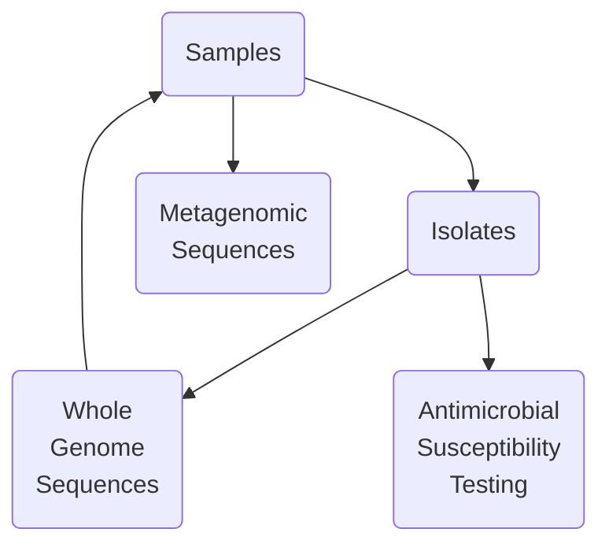

# Introduction

All data collected by researchers participating in the GRDI-AMR2 project is expected to be formatted according to the GRDI-AMR2 One Health standard and collected in a central database (the VMR).
This is to ensure long-term accessibility of the data and facilitate analyses across labs and departments.
Since metadata associated with each project is likely to look very different from the standard, some work must be done to format or _harmonize_ the data to the standard.
This SOP outlines the workflow for handling sample and isolate data, sequence submission, metadata curation.
It will also outline the process for submitting data to the database, as well as to the NCBI and IRIDA.

# Terms

- **The Virtual Microbial Resource (VMR):** The central database that is storing the metadata.
    This database ensures the integrity of the metadata and provides additional functionality, such as exporting to other formats.
- **The GRDI-AMR One Health data standard:** The set of fields, terms, and rules that represent how data should be formatted.
- **The Science Network:** The National Microbiology Laboratory branch of PHAC has its own suite of servers and IT infrastructure to host and support science projects withing the branch.
    Access to this network has been extended to all members of the GRDI-AMR2 to support the project.
    Access will be required to upload and access sequences on IRIDA, and view dashboards connected to the VMR.
    While most researchers _should_ already their own science network account, it may need to be renewed.
    Please contact Emil Jurga (emil.jurga@phac-aspc.gc.ca) or the NML's Science IT Helpdesk (helpdesk@nml-lmn.phac-aspc.gc.ca) to either renew or request an account.
- **IRIDA:** Integrated Rapid Infectious Disease Analysis tool. 
    This application hosts sequencing data. 
    When connected to the Science Network VPN, the link is [ngs-archive.corefacility.ca](ngs-archive.corefacility.ca).

# Tools 

Each lab is likely to have their own methods for collecting and storing metadata, from Excel workbooks, to SQL or Microsoft Access or SQL databases, or even plain text files (e.g., CSV or TSV formats).
Possibly, different formats are used for different types of data. 
At this point, two different tools have been made accessible to help researchers format their data according to the GRDI-AMR OneHealth data standard:

1. The Excel Workbook ([GitHub repository link](https://github.com/cidgoh/GRDI_AMR_One_Health)).
   This is an Excel Workbook with the fields and controlled vocabulary implemented. 
   Different metadata categories are split across different tabs in the workbook.
   Excel macros are used to combine the sheets at the end, but this functionality is not required to insert the data into the VMR.
   This method has the advantage of being implemented using a familiar tool to most researchers.
   However, some researchers might find it slow to use, particularly with datasets comprising many rows.
   Note that this repo also contains documentation and SOPs regarding the fields and terms of the standard.
2. The DataHarmonizer ([GitHub repository link](https://github.com/cidgoh/pathogen-genomics-package)).
   This is a web-based application purpose built to help researchers format data according the pre-defined data standards.
   It is also based on a spreadsheet layout (e.g., with rows, fields, and cells) but implements multiple useful features such as data-validation, search bars for fields, and help-dialogues.
   Installation of the tool is relatively simple (instructions at the link).

# Overview:

In general, it is likely that researcher's data

Data submission to WP6 is best undertaken in a series of steps, with checkpoints with the data curators along each step of the way to catch errors quickly and assess/add new terms or fields as needed:

1. Identify data fields in your data that map to fields in the data standard. 
2. Identify data fields in the standard that could be applicable to your own data (even if they are not directly
   applicable to your own research goals) 

Rather then standardizing all the data at the end of the collection or research process

The data harmonization and submission process is best

# How to harmonize

There are two options to begin the harmonization of your data

Download the Data Harmonizer software from here (v5.3). 

Install and Open: 

Extract the contents of the downloaded ZIP file. 

Open the index.html file in a browser. 

Change to the GRDI-AMR template using the navigation bar. 

Editing: Fill out the template with information about samples and isolates. For Whole Genome Sequencing (WGS) experiments, include both sample and isolate data. For metagenomics or 16S experiments, only the sample information is required. 

Saving: Once the spreadsheet is complete, save it as an .xls file. 

# Metadata Submission and Curation 

Submit Metadata: 

After filling the Data Harmonizer template, the .xls file should be sent to: 

Emma Griffiths: emma_griffiths@sfu.ca for metadata curation. 

Metadata needs to be submitted to VMR administrators: 

Emil Jurga: emil.jurga@phac-aspc.gc.ca 

Gabriel Wajnberg: gabriel.wajnberg@inspection.gc.ca 

Tools to help curation: 

Some datasets are big and can be grouped by data types. Sample information can be shared by multiple samples a different template (example here) can be used to fill out and sent to curation. 

Partial Metadata Submission: 

If all metadata is not available, the data can be sent in stages (e.g., without AST data). Additional data, like AST, can be submitted later in different formats. 

4. Metadata Field Reference 

If clarification is needed on specific metadata fields in the Data Harmonizer, consult the GRDI AMR One Health Reference Guide. In case of having a metagenomics experiment, use “Metagenome” as a value in “Organism” field. 

5. Uploading Sequencing Data to IRIDA 

    Upload all sequencing files (FASTQ) to IRIDA. 

    Provide access to the VMR administrators to allow them to link metadata with the sequence data. 

    VMR administrators may also provide additional information about the sequences for inclusion in the VMR. 

6. Special Case: Pooled Sequencing 

In cases where a pool of samples is sequenced together: 

    Individual Rows for Each Sample: Ensure that each sample in the pool has its own row in the metadata, as metadata specifics may differ. 

    Library IDs: Even though multiple samples may share the same library ID, each row should represent a distinct sample. 

7. Submission to NCBI BioSample and BioProject 

    BioSample Submission: 

    For WGS experiments, use the OneHealth Enteric template. 

    For metagenomics or 16S experiments, use the metagenome template. 

    BioProject Linking: 

    Use the following umbrella projects to link your submissions: 

    For bacterial isolates (food, animal, environmental sources): PRJNA1076250 

    For metagenomes (food, animal, environmental sources): PRJNA1139734 

    For experimental data (e.g., passaged isolates, transconjugants, mutants): PRJNA1143527 

    Linking Previous Submissions: 

    If you need to link previous submissions to these umbrella projects, email bioprojecthelp@ncbi.nlm.nih.gov with the relevant umbrella project ID. 

8. Metadata Standards 

All isolate and sample metadata should adhere to GRDI-AMR2 metadata standards. Consult the WP6 leads for any assistance required in meeting these standards. 

This workflow ensures that the data from GRDI-AMR2 projects is properly collected, harmonized, and submitted to relevant databases, allowing smooth integration into the VMR and NCBI. 
