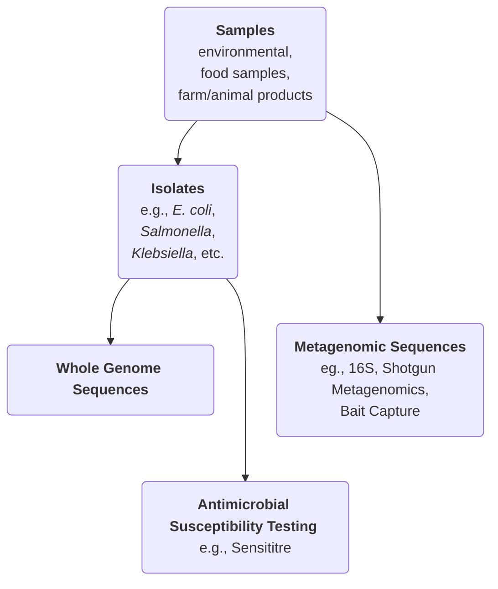
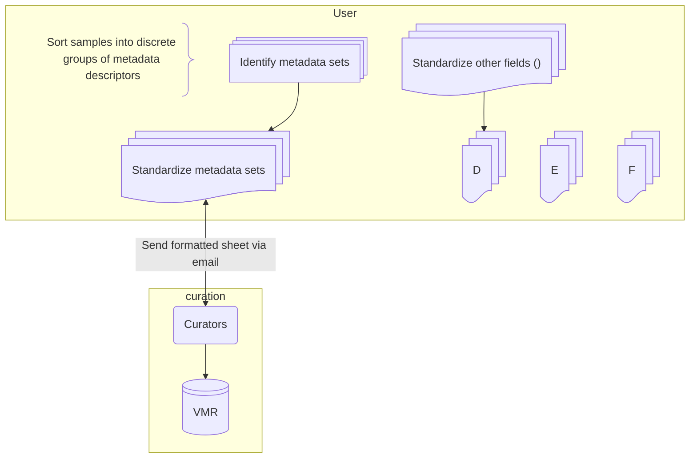

# Introduction

All data collected by researchers participating in the GRDI-AMR2 project is expected to be formatted according to the GRDI-AMR2 One Health standard and collected in a central database (the VMR).
This is to ensure long-term accessibility of the data and facilitate analyses across labs and departments.
Since metadata associated with each project is likely to look very different from the standard, some work must be done to format or _harmonize_ the data to the standard.
This SOP outlines the workflow for handling sample and isolate data, sequence submission, metadata curation.
It will also outline the process for submitting data to the database, as well as to the NCBI and IRIDA.

For this SOP, we will be using some example data to help clarify. 

# Terms

- **The GRDI-AMR One Health data standard:** The set of fields, terms, and rules that represent how data should be formatted.
- **The Virtual Microbial Resource (VMR):** The central database that is storing the metadata.
    This database ensures the integrity of the metadata and provides additional functionality, such as exporting to other formats.
- **The Science Network:** The National Microbiology Laboratory branch of PHAC has its own suite of servers and IT infrastructure to host and support science projects withing the branch.
    Access to this network has been extended to all members of the GRDI-AMR2 to support the project.
    Access will be required to upload and access sequences on IRIDA, and view dashboards connected to the VMR.
    While most researchers _should_ already their own science network account, it may need to be renewed.
    Please contact Emil Jurga (emil.jurga@phac-aspc.gc.ca) or the [NML's Science IT Helpdesk](mailto:helpdesk@nml-lmn.phac-aspc.gc.ca) to either renew or request an account.
    The VPN address is [remote.corefacility.ca](remote.corefacility.ca).
- **IRIDA:** Integrated Rapid Infectious Disease Analysis tool. 
    This application hosts sequencing data. 
    When connected to the Science Network VPN, the link is [ngs-archive.corefacility.ca](ngs-archive.corefacility.ca).
- The GC

# Tools 

Each lab is likely to have their own methods for collecting and storing metadata, from Excel workbooks, to SQL or Microsoft Access or SQL databases, or even plain text files (e.g., CSV or TSV formats).
Possibly, different formats are used for different types of data. 
At this point, two different tools have been made accessible to help researchers format their data according to the GRDI-AMR OneHealth data standard:

1. The Excel Workbook ([GitHub repository link](https://github.com/cidgoh/GRDI_AMR_One_Health)).
   This is an Excel Workbook with the fields and controlled vocabulary implemented. 
   Different metadata categories are split across different tabs in the workbook.
   Excel macros are used to combine the sheets at the end, but this functionality is not required to insert the data into the VMR.
   This method has the advantage of being implemented using a familiar tool to most researchers.
   However, some researchers might find it slow to use, particularly with datasets comprising many rows.
   Note that this repo also contains documentation and SOPs regarding the fields and terms of the standard.
2. The DataHarmonizer ([GitHub repository link](https://github.com/cidgoh/pathogen-genomics-package)).
   This is a web-based application purpose built to help researchers format data according the pre-defined data standards.
   It is also based on a spreadsheet layout (e.g., with rows, fields, and cells) but implements multiple useful features such as data-validation, search bars for fields, and help-dialogues.
   Installation of the tool is relatively simple (instructions at the link).
   Note that the default data template is **not** the GRDI-AMR2 data standard, make sure to select the GRDI template before proceeding.

# Overview:

In general, it is likely that metadata collected follows a similar hierarchical structure.

In general, the researcher takes _samples_ of whatever it is they are studying, be it a food product, animal or human tissue or waste, or environmental samples of water, soil, or wastewater (and etc).
From these samples, the researcher might _isolate_ microorganisms for further study.
Most researchers of GRDI-AMR2 are leveraging genomic sequencing in some capacity.
Bacterial isolates might be processed for whole genome sequences, or samples might be processed for shotgun metagenomics or bait capture.
In addition, some bacterial isolates might be sent off for antimicrobial susceptibility testing.
Throughout, it is possible that many isolates might be taken from a single sample, or perhaps none at all.
Similarly, an isolate might be sequenced multiple times.
Some projects have opted not to isolate any bacteria from their samples at all, opting instead for a pure metagenomics approach.
Whatever the structure of your data, submission to WP6 is best undertaken in parallel series of steps, with checkpoints with the data curators along the way to catch errors quickly and assess/add new terms or fields as needed.

1. Identify data fields in the standard that could be applicable to your own data (even if they are not directly applicable to your own research goals)
2. Group 

# Sample and collection information

## A note on sample names

You likely have assigned a sample ID of some kind to your data.
This should be designated as the "sample_collector_sample_id" field in the standard.
For the purposes of the GRDI-AMR2 Project, we expect sample IDs to be *unique across the entire project*.
Therefore, sample IDs that are too short or generic are not acceptable (for example, sample names consisting only of a short string of alphanumerics).
In addition, please refrain from populating a sample ID with metadata (e.g., canada-coconut-01A) - this can lead to confusion, particularly if downstream metadata is updated.
We recommend (TODO: What does Cathy like?)
However, if you do need to change your sample IDs, please put the original ID in the alternative_sample_IDS column, in case you or another researcher needs to refer to them again.

## Identifying sample types

There are many fields that can be filled out in the GRDI-AMR OneHealth data standard.
Not all of them will be applicable to every research project or work-package.
However, we ask researchers to fill out the template as completely as possible, even if the fields are of no interest to your particular research questions.
For example, in a project taking feces samples from farms, the researcher might be concerned only with the organism (e.g., cow, chicken, pig).
Even so, the data standard has fields that request additional information, such as the breed, farming purpose (e.g., meat or dairy production), and even farming practices (e.g., conventional or organic).
Including this information will make your data more useful for future analyses, and especially for risk-analysis and machine learning.

The first step in the data harmonization is to identify any fields that you might reasonably be able apply to your samples.
Look through the fields and their descriptions to see if any apply.
Taking a look at the allowed terms might help with deciding if a field could applies.
The GitHub repo of the standard contains both field descriptions, possible terms, and SOPs for filling out fields; this documentation can be found at these links. TODO: add links
If you are unsure which of your metadata values correspond to which term, then you might want to use the [Ontological Lookup Service](https://www.ebi.ac.uk/ols4) to lookup the ontology term ID
(e.g., for "coconut meat (frozen)", the ontology IS *FOODON_00003857*) and get its description.
This is also a good stage to ask the curators for help.
In some cases, there might not be a standard term that fits one of your metadata values -- Send an email to the curators and they can add the term for you.

Even relatively modest sampling plans might still have hundreds of samples, and filling out each field, for each sample, might be prohibitively arduous.
Fortunately, it is likely that your samples can be grouped into discrete sets that share metadata fields.
For example, while WP4.2's stone fruit data consists of 163 samples, these samples can broadly be grouped into 6 types:

| Field Name                           | Frozen coconut-chunks                                                                    | Frozen coconut-shredded                                                                                  | Frozen Mango                                                                             | Frozen Avocado                                                                             | Frozen Peaches                                                                           |
| ---                                  | ---                                                                                      | ---                                                                                                      | ---                                                                                      | ---                                                                                        | ---                                                                                      |
| original_sample_description          | Frozen coconut-chunks                                                                    | Frozen coconut-shredded                                                                                  | Frozen Mango                                                                             | Frozen Avocado                                                                             | Frozen Peaches                                                                           |
| sample_collected_by                  | Canadian Food Inspection Agency (CFIA) [GENEPIO:0100552]                                 | Canadian Food Inspection Agency (CFIA) [GENEPIO:0100552]                                                 | Canadian Food Inspection Agency (CFIA) [GENEPIO:0100552]                                 | Canadian Food Inspection Agency (CFIA) [GENEPIO:0100552]                                   | Canadian Food Inspection Agency (CFIA) [GENEPIO:0100552]                                 |
| purpose_of_sampling                  | Survey study [GENEPIO:0100582]                                                           | Survey study [GENEPIO:0100582]                                                                           | Survey study [GENEPIO:0100582]                                                           | Survey study [GENEPIO:0100582]                                                             | Survey study [GENEPIO:0100582]                                                           |
| geo_loc_name (country)               | Canada [GAZ:00002560]                                                                    | Canada [GAZ:00002560]                                                                                    | Canada [GAZ:00002560]                                                                    | Canada [GAZ:00002560]                                                                      | Canada [GAZ:00002560]                                                                    |
| geo_loc_name (state/province/region) | Ontario [GAZ:00002563]                                                                   | Ontario [GAZ:00002563]                                                                                   | Ontario [GAZ:00002563]                                                                   | Ontario [GAZ:00002563]                                                                     | Ontario [GAZ:00002563], Quebec [GAZ:00002569]                                            |
| environmental_site                   | Retail environment [ENVO:01001448]                                                       | Retail environment [ENVO:01001448]                                                                       | Retail environment [ENVO:01001448]                                                       | Retail environment [ENVO:01001448]                                                         | Retail environment [ENVO:01001448]                                                       |
| food_product                         | coconut meat (frozen) [FOODON_00003857]                                                  | coconut meat (frozen) [FOODON_00003857]                                                                  | Mango [FOODON:00003538]                                                                  | Avocado [FOODON:00003600]                                                                  | Peach (frozen) [FOODON:03301272]                                                         |
| food_product_properties              | Ready-to-eat (RTE) [FOODON:03316636]; sliced [FOODON:03430137]; frozen [FOODON:03302148] | Ready-to (RTE) [FOODON:03316636]; sliced, thin, below 0.5 cm [FOODON:03430145]; frozen [FOODON:03302148] | Ready-to-eat (RTE) [FOODON:03316636]; sliced [FOODON:03430137]; frozen [FOODON:03302148] | Ready-to-eat (RTE) [FOODON:03316636]; ; sliced [FOODON:03430137]; frozen [FOODON:03302148] | Ready-to-eat (RTE) [FOODON:03316636]; sliced [FOODON:03430137]; frozen [FOODON:03302148] |
| food_packaging                       | Plastic bag, sack or pouch [FOODON:03490166]                                             | Plastic bag, sack or pouch [FOODON:03490166]                                                             | Plastic bag, sack or pouch [FOODON:03490166]                                             | Plastic bag, sack or pouch [FOODON:03490166]                                               | Plastic bag, sack or pouch [FOODON:03490166]                                             |

In the above example, we see that many of the fields are actually the same across all the metadata fields (e.g., all the samples are collected by the CFIA, and the "purpose_of_sampling" is always a Survey Study).
In the data, the "food_product" related fields might change sample to sample, but is consistent across a sample group, and so only needs to be set once for it to apply to all samples in the group.
Now, so long as each individual sample is associated with a _sample group_, the curators can easily apply the metadata fields to each sample.
We recommend setting the "original_sample_description" to your sample groups for each sample.

Setting metadata values this way has two advantages.
First, it reduces the amount of labor required to standardize; in the above example, we effectively needed to fill out metadata for only 6 samples, instead of 173.
Second, it is easier for the metadata curators to glance at the metadata fields and assess if anything is missing, or needs to be changed.
If your data can be organized like this, we encourage you to do so and send it to the curators before proceeding with the rest of your data.
An excel sheet to help with this can be found here (TODO: add link).

## Variable sample fields

After the curators have verified that the sample group metadata looks alright, you can move on to standardizing the rest of the sample collection metadata
Date fields, such as "sample_collected_date" and "sample_received_date" are commonly too variable to be sorted neatly into groups.
How to standardize these fields will depend on how your data is formatted.
In some cases, it might be as simple as renaming the column, while others might require some converting between formats.
Excel provides functionality to convert between date formats, for example.

For categorical fields, this might be as easy as a search-and-replace.
In the stone fruit data, a variable field is the country of origin.
First, determine how many unique values there are -- in the stone fruit data, there are 12 (e.g., USA, Peru, India).
For each value, choose its corresponding ontology term from the possible list of values, and execute a find-and-replace (e.g., USA -> United States of America [GAZ:00002459], Peru -> Peru [GAZ:00002932]).

## A note on "negative" samples.

There might be cases in which a sample is collected, but results in no useful downstream data (e.g., no isolates are extracted, or no sequences are collected).
We request that you **include these sample data** when you submit your metadata to the curators.
These samples can still provide valuable information for risk-management and documentation.

# Isolate metadata

As with sample names, isolate IDs must be unique across the entire project.
If you need to rename your isolate IDS, please put their original names under the "alternative_isolate_IDs" column.

As with 

# Sequencing data

Most of the GRDI-AMR2 work packages are leveraging sequencing data of some kind.
The GRDI-AMR2 data standard has many metadata fields relating to the extraction of DNA (i.e., the preparation of sequencing libraries) and sequencing of libraries (e.g., sequencer make and model).
After you have submitted your sample collection metadata (and isolate metadata, if applicable), please send us the sequencing metadata.
Here too is a good opportunity to checkpoint with the curators: Send us a sample of 10-20 sequencing records that you have standardized, and we can verify that the fields are filled out correctly.
After this has been cleared, you may proceed with sending us sequencing metadata data.

## Using IRIDA

The VMR is the ultimate repository for metadata, including sequence metadata.
However, it _does not_ store the dna sequence data itself (i.e., the data representing the ATGC's of the sample/isolate's DNA).
The NML's IRIDA platform is being used for this project to store the raw sequence data.
Here, we will describe how to upload data to IRIDA.
Note that you will need to activate an account to access the NML's IRIDA instance -- This account is _separate_ to the Science Account you use to access the VPN.
Contact Emil Jurga OR the [NML's Science IT Helpdesk](mailto:helpdesk@nml-lmn.phac-aspc.gc.ca) to create an account.

1. Log into the NML's Science Network VPN
2. Log into IRIDA
3. Create a new project for your data.
4. Create Samples
5.
6.

IRIDA must be accessed when connected to the Science Network VPN, the link is [ngs-archive.corefacility.ca](ngs-archive.corefacility.ca).

## Pooled samples for metagenomics

# How to harmonize

Emma Griffiths: emma_griffiths@sfu.ca for metadata curation. 

Metadata needs to be submitted to VMR administrators: 

Emil Jurga: emil.jurga@phac-aspc.gc.ca 

Gabriel Wajnberg: gabriel.wajnberg@inspection.gc.ca 

# Antimicrobial Susceptibility Testing

Many researchers may be producing Antimicrobial Susceptibility Testing (AST) data from isolates.
This data must also be standardized.
However, the current implementation of AST data in both the DataHarmonizer and the Excel Template is wide-form: It is spread over 600 columns!
This is not feasible to fill by hand for anything more then a handful of samples.
For this reason **it is out recommendation that researchers do not standardize their AST data by hand**.
Instead, please send your AST data to the curators for us to standardize using our scripts.
If possible, send the data to the curators in its *most unprocessed form* (e.g., if your data is produced by a Sensititre, please send us its output, rather then importing it into Excel and modifying it).

4. Metadata Field Reference 

If clarification is needed on specific metadata fields in the Data Harmonizer, consult the GRDI AMR One Health Reference Guide. In case of having a metagenomics experiment, use “Metagenome” as a value in “Organism” field. 

# Sequences

5. Uploading Sequencing Data to IRIDA 

    Upload all sequencing files (FASTQ) to IRIDA. 

    Provide access to the VMR administrators to allow them to link metadata with the sequence data. 

    VMR administrators may also provide additional information about the sequences for inclusion in the VMR. 

6. Special Case: Pooled Sequencing 

In cases where a pool of samples is sequenced together: 

    Individual Rows for Each Sample: Ensure that each sample in the pool has its own row in the metadata, as metadata specifics may differ. 

    Library IDs: Even though multiple samples may share the same library ID, each row should represent a distinct sample. 

# Submission to the NCBI

    BioSample Submission: 

    For WGS experiments, use the OneHealth Enteric template. 

    For metagenomics or 16S experiments, use the metagenome template. 

    BioProject Linking: 

    Use the following umbrella projects to link your submissions: 

    For bacterial isolates (food, animal, environmental sources): PRJNA1076250 

    For metagenomes (food, animal, environmental sources): PRJNA1139734 

    For experimental data (e.g., passaged isolates, transconjugants, mutants): PRJNA1143527 

    Linking Previous Submissions: 

    If you need to link previous submissions to these umbrella projects, email bioprojecthelp@ncbi.nlm.nih.gov with the relevant umbrella project ID. 

